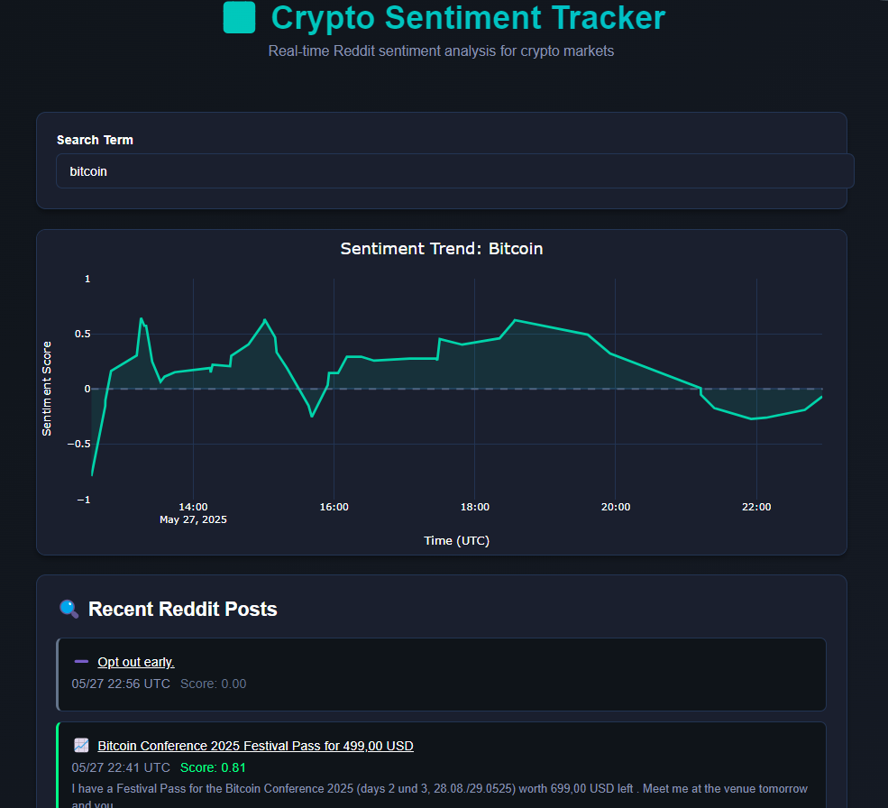

# Real-Time Crypto Sentiment Tracker

A simple Dash application that monitors Reddit in real time for posts containing a keyword (e.g. crypto tokens), runs sentiment analysis on each post with VADER, and plots a live sentiment score over time.




---

## Features

- **Live Data Fetching**  
  Polls Reddit every _n_ seconds for new posts in specified subreddits.
- **VADER Sentiment Analysis**  
  Scores each post’s title/body using NLTK’s VADER and computes a compound sentiment value.
- **Interactive Graph**  
  Uses Plotly + Dash to display an updating line chart of sentiment scores.
- **Customizable**  
  Easily change the search term(s), subreddits, polling interval, and graph styling.

---

## Prerequisites

- Python 3.7+  
- A Reddit account (optional for higher rate limits)  
- Basic familiarity with virtual environments

---

## Installation

1. **Clone the repo**  
   ```bash
   git clone https://github.com/your-username/crypto-sentiment-tracker.git
   cd crypto-sentiment-tracker
2. pip install -r requirements.txt
